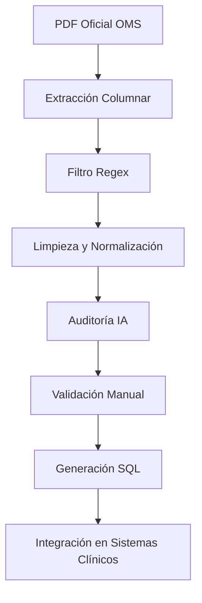

# CIE-O 3.1 – Catálogos Oficiales de Órganos, Topografía y Morfología  
**Clasificación Internacional de Enfermedades Oncológicas – Versión 3.1**  
**Hecho en Chile 🇨🇱 | Dataset validado con IA 🤖 | Datos limpios, estructurados y auditados**

---

# 🌍 Nombre Internacional vs Nombre en Español

Esta clasificación corresponde al estándar internacional oficial:

### **ICD-O 3.1 – International Classification of Diseases for Oncology (WHO)**

En los países de habla hispana se utiliza su versión traducida:

### **CIE-O 3.1 – Clasificación Internacional de Enfermedades Oncológicas**

> Ambos nombres se refieren exactamente al mismo sistema de codificación oncológica de la OMS.  
> Este repositorio utiliza “CIE-O” por estar orientado a instituciones clínicas de Chile, pero los datos son **idénticos** al estándar ICD-O 3.1.

---

# 📘 Introducción

Este repositorio contiene una versión **limpia, normalizada y validada** de los catálogos oficiales **CIE-O / ICD-O 3.1**, derivados exclusivamente de la **Lista Numérica / Tabular** del documento de la Organización Mundial de la Salud.

Su propósito es apoyar a:

- Laboratorios clínicos  
- Servicios de Anatomía Patológica  
- Sistemas LIMS  
- Registros de cáncer  
- Instituciones de investigación  
- Universidades y centros de formación  
- Desarrolladores de software de salud  

Este proyecto es mantenido por **SysLAB Ingeniería**, empresa chilena especializada en salud digital, sistemas clínicos y automatización de laboratorios.

---

# 🏗 Estructura del Repositorio

```
CIE-O-3.1/
│
├── sql/
│    ├── cieo_3_1_organos.sql
│    ├── cieo_3_1_topografia.sql
│    ├── cieo_3_1_morfologia.sql
│    └── cieo_grados.sql
│
├── pdf/
│    └── (archivos no incluidos por restricciones OMS)
│
└── README.md
```

---

# 🧬 Contenido del Dataset

## 1️⃣ Órganos (C00–C80)
68 grupos anatómicos raíz. Útiles para clasificación primaria y agrupación clínica.

## 2️⃣ Topografía (C00.0–C80.9)
Extraída desde las páginas 43–63 de la Lista Tabular oficial de ICD-O 3.1.  
Incluye únicamente códigos válidos con descripción completa.

## 3️⃣ Morfología (8000/0–9992/3)
Extraída desde las páginas 69–109.  
Incluye más de 1.500 códigos con comportamiento estandarizado.

## 4️⃣ Grados Histológicos
Archivo auxiliar `cieo_grados.sql` con las categorías estándar de grado tumoral.

---

# 🧩 Jerarquía Conceptual

Aunque ICD-O / CIE-O **no define claves foráneas**, la estructura semántica sigue esta jerarquía:

```
Órgano (Cxx)
   └── Topografía (Cxx.x)
           └── Morfología (xxxx/y)
```

Ejemplo:

```
C50       → Órgano: Mama
C50.1     → Topografía: Cuadrante central
8500/3    → Morfología: Carcinoma ductal infiltrante
```

---

# 🔗 Relaciones recomendadas (sin FK)

## Relación Órgano → Topografía (por prefijo)
```sql
SELECT t.*
FROM cieo_3_1_topografia t
WHERE t.codigo LIKE 'C50%';
```

## Búsqueda de morfología maligna
```sql
SELECT *
FROM cieo_3_1_morfologia
WHERE comportamiento = '3';
```

## Búsqueda textual
```sql
SELECT *
FROM cieo_3_1_morfologia
WHERE descripcion LIKE '%ductal%';
```

## Combinar datos para una UI clínica
```sql
SELECT 
    o.nombre AS organo,
    t.codigo AS topografia,
    t.descripcion AS sitio,
    m.codigo AS morfologia,
    m.descripcion AS diagnostico
FROM cieo_3_1_organos o
JOIN cieo_3_1_topografia t ON t.codigo LIKE CONCAT(o.codigo_raiz, '%')
JOIN cieo_3_1_morfologia m
WHERE o.codigo_raiz = 'C50';
```

---

# 📊 Diagrama del Flujo de Extracción (Mermaid)



---

# 🏥 Integración en Sistemas Clínicos

Este dataset es adecuado para:

- LIMS  
- HIS / RIS  
- Módulos de Anatomía Patológica  
- Sistemas de registro oncológico  
- Aplicaciones de IA médica  

---

# 🔬 SysPATH® – Sistema LIMS de Anatomía Patológica

**SysPATH®** es una plataforma 100% web desarrollada por **SysLAB Ingeniería** para apoyar todas las etapas del proceso en un laboratorio de Anatomía Patológica:

- Registro de solicitudes  
- Trazabilidad completa de muestras  
- Control macro y micro  
- Gestión de cassettes y portaobjetos  
- Impresión de códigos 2D, QR y Datamatrix  
- Generación de informes HTML/PDF  
- Estadísticas en tiempo real  
- Definición dinámica de codificaciones  
- Integración con algoritmos de IA diagnóstica  

Más información:  
🌐 https://www.syslab.cl  
📧 contacto@syslab.cl  

---

# ⚠️ Sobre el PDF de ICD-O 3.1

El **PDF oficial no puede publicarse** debido a restricciones de derechos de autor de la OMS.  
Este repositorio solo incluye **datos derivados**, cuya publicación sí es permitida.

---

# 📄 Licencia

Este repositorio se distribuye bajo licencia **MIT**.

---

# 🤝 Contribuciones

Mejoras, nuevas validaciones y aportes son bienvenidos.  
Haz un Fork o un Pull Request.

---

# ⭐ Agradecimientos

Si este proyecto te fue útil, apóyalo con una ⭐ en GitHub.
